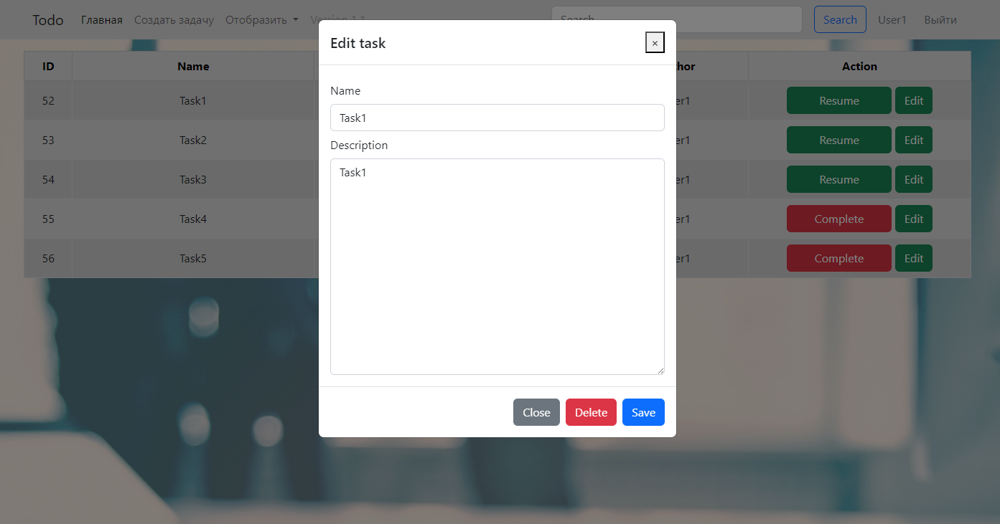

# Проект "ToDo" (В процессе разработки)

* [Описание](#описание)
* [Функционал](#функционал)
* [Технологии](#технологии)
* [Требования к окружению](#требования-к-окружению)
* [Запуск](#запуск)
* [Интерфейс](#интерфейс)
* [Дальнейшее развитие](#дальнейшее-развитие)
* [Автор](#автор)

## Описание

MVC REST API приложение. Данное веб-приложение представляет собой сайт, где пользователи могут управлять списком задач.
Они имеют возможность создавать новые задачи, просматривать существующие, редактировать их, отмечать как выполненные или
удалять.
Пользователи также могут фильтровать задачи по категориям "все", "новые" или "завершенные".
Каждый пользователь видит только свои собственные задачи. Кроме того, время создания задачи отображается в соответствии
с его часовым поясом.

## Функционал

* Вывод всех задач;
* Вывод задач по статусу;
* Добавление задачи в todo-list;
* Редактирование задач;
* Хранение данных в БД PostgreSQL;
* Регистрация и авторизация пользователей;
* Поддержка временных зон;
* Карточка пользователя.

## Технологии

* Java 17 LTS;
* Spring boot (Thymeleaf/WEB/Test starter)
* PostgreSQL 15;
* Hibernate 5;
* Log4j;
* Maven;
* Liquibase;
* JQuery;
* Bootstrap 5;
* HTML5;
* CSS;

## Требования к окружению

* Java 17;
* PostgreSQL 15.1;
* Apache Maven 3.8.4;

## Запуск

Для локального запуска проекта необходимо:

- Клонировать репозиторий;
- Создать базу данных PostgresSQL:

```sql
CREATE DATABASE todo;
```

- Подгрузить необходимые зависимости через Maven.

## Интерфейс

#### Авторизация


#### Регистрация


#### Список всех задач


#### Создание задачи


#### Редактирование задачи



## Дальнейшее развитие

- Version 1.2 - Добавить пагинацию для списка задач, сделать возможность фильтрации по степени важности.
- Version 1.3 - Добавить фильтры по категориям, предусмотреть возможность связать приложение с Телеграмм для
  предварительного извещения.
- Version 1.4 - Осуществить переход на Spring-data-jpa, расширить возможности фильтрации.

## Автор

Michael Zalogin

https://t.me/RuntoJun
zaloginmiha@gmail.com

+79111480757