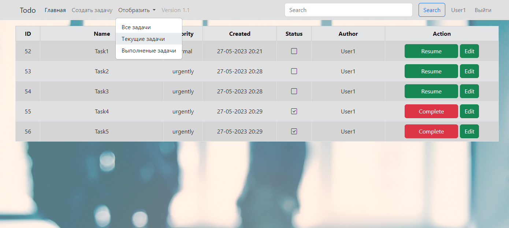

# Проект "ToDo" (В процессе разработки)

* [Описание](#описание)
* [Функционал](#функционал)
* [Технологии](#технологии)
* [Интерфейс](#интерфейс)
* [Автор](#автор)

## Описание

MVC REST API - приложение, todo-список дел.

## Функционал

* Вывод всех задач;
* Вывод только незавершённых задач;
* Добавление задачи в todo-list;
* Редактирование задач;
* Хранение данных в БД PostgreSQL:

## Технологии

* Java 17 LTS;
* Spring boot;
* PostgreSQL;
* Hibernate 5;
* Apache Tomcat Server;
* Thymeleaf;
* HTML, Bootstrap5;
* Log4j;
* Maven;
* Liquibase.

## Интерфейс

* Список всех задач
  

* Создание задачи
  

* Редактирование задачи
  

## Автор

Michael Zalogin

zaloginmiha@gmail.com

+79111480757